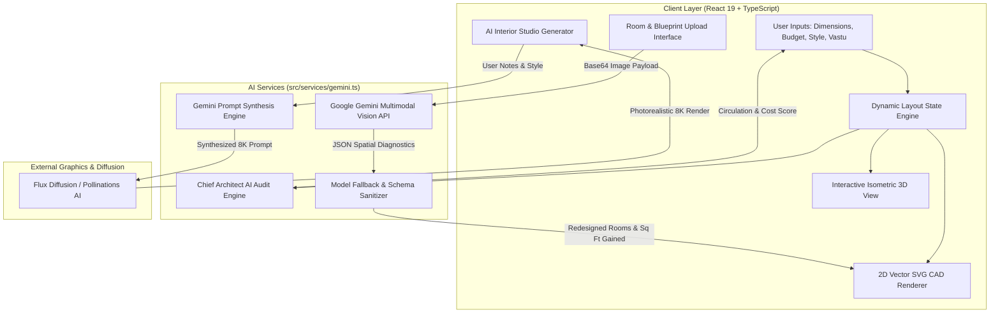

# 🏛️ AURA — AI Interior & Architectural Spatial Planner

[](https://react.dev/)
[](https://www.typescriptlang.org/)
[](https://tailwindcss.com/)
[](https://vitejs.dev/)
[](https://ai.google.dev/)

> **A luxury architectural spatial planner and generative AI interior design platform.** Built with React 19, TypeScript, Tailwind CSS v4, and Google Gemini Multimodal Vision, AURA combines parametric 2D vector CAD blueprint generation, interactive isometric 3D dollhouse visualization, and automated spatial optimization into an editorial, magazine-grade interface.

---

## 📑 Table of Contents

- [🌟 Key Highlights & Philosophy](#-key-highlights--philosophy)
- [✨ Comprehensive Feature Breakdown](#-comprehensive-feature-breakdown)
  - [1. Editorial Architectural Hero & Floating Pill Navigation](#1-editorial-architectural-hero--floating-pill-navigation)
  - [2. Parametric 2D House Planner & CAD Floor Plan Engine](#2-parametric-2d-house-planner--cad-floor-plan-engine)
  - [3. Interactive Isometric 3D Dollhouse View](#3-interactive-isometric-3d-dollhouse-view)
  - [4. Multimodal AI Room & Blueprint Scanner (Gemini Vision)](#4-multimodal-ai-room--blueprint-scanner-gemini-vision)
  - [5. Dual-Theme Blueprint Comparison Engine (Original vs. Redesigned)](#5-dual-theme-blueprint-comparison-engine-original-vs-redesigned)
  - [6. AI Interior Studio (Prompt Engineering + Flux Diffusion)](#6-ai-interior-studio-prompt-engineering--flux-diffusion)
  - [7. Automated Chief Architect AI Floor Plan Audit](#7-automated-chief-architect-ai-floor-plan-audit)
  - [8. Verified Workforce Marketplace (Direct Hire)](#8-verified-workforce-marketplace-direct-hire)
  - [9. Devun Architectural Cost & Timeline Calculator](#9-devun-architectural-cost--timeline-calculator)
  - [10. Collison Signature Architectural Showcase](#10-collison-signature-architectural-showcase)
  - [11. Curated Architectural Portfolio & High-Res Lightbox](#11-curated-architectural-portfolio--high-res-lightbox)
  - [12. Comprehensive Architectural Services Section](#12-comprehensive-architectural-services-section)
  - [13. Multi-Format Exporter & Real-Time Share Engine](#13-multi-format-exporter--real-time-share-engine)
  - [14. Consultation Booking Engine](#14-consultation-booking-engine)
- [🏗️ System Architecture & Data Flow](#️-system-architecture--data-flow)
- [💻 Tech Stack & Tooling](#-tech-stack--tooling)
- [📁 Project Directory Structure](#-project-directory-structure)
- [🚀 Getting Started & Local Setup](#-getting-started--local-setup)
- [🔑 Environment Variables & API Configuration](#-environment-variables--api-configuration)
- [🎨 Design System & Aesthetics](#-design-system--aesthetics)
- [📄 License](#-license)

---

## 🌟 Key Highlights & Philosophy

- **Bridging Vision & Execution**: Seamlessly connects high-level spatial AI concepts with actual structural engineering, verified trade contractors, and localized cost estimation.
- **Editorial Luxury Aesthetic**: Inspired by high-end architectural publications (such as *Architectural Digest*, *Devun*, and *Collison*), featuring fluted ribbed glass, offset hairline framing, custom serif & display typography, and warm tactile sand palettes.
- **Parametric CAD Generation**: Computes wall thicknesses, door-swing arcs, zone labels, and furniture footprints mathematically on an SVG coordinate grid.
- **Zero Hallucination Tolerance**: Uses structured JSON schemas, temperature clamping, model fallbacks, and resilient architectural defaults for production stability.

---

## ✨ Comprehensive Feature Breakdown

### 1. Editorial Architectural Hero & Floating Pill Navigation
- **Floating Pill Nav**: Glassmorphic blur header (`backdrop-blur-md`) with product dropdowns, quick navigation anchors, direct-hire workforce badges, and direct triggers for the AI Studio & Consultation modals.
- **Hero Showcase**: Monolithic typography with outline lettering, fluted glass overlays, client satisfaction counters animated via custom easing, and high-resolution architectural photography.

### 2. Parametric 2D House Planner & CAD Floor Plan Engine
- **Configurable Plot Parameters**:
  - Plot dimensions: Width (15 – 80 ft) & Depth (20 – 100 ft)
  - Multi-floor planning (Ground, G+1 Duplex, G+2 Triplex)
  - Budget Tier: ₹15 Lakhs to ₹1.5+ Crores (with automated currency formatting and Indian numbering system conversions)
  - Family configuration (Couple, Nuclear, Joint Family, Multi-Gen)
  - Architectural Aesthetic: **Modern**, **Luxury**, **Traditional**, **Minimalist**, **Japandi**, **Boho Chic**
  - Regional context adaptation (Bangalore, Mumbai, Delhi NCR, Hyderabad, Chennai, Kerala, Kolkata)
  - Plot Facing / Vastu Orientation (North, East, South, West)
  - Parking specifications (1 Car + 2 Bikes, 2 Cars Portico, Compact, None)
- **Vector CAD Rendering (`<FloorPlanSVG />`)**:
  - Dynamically renders boundary walls, interior partition dry-walls, and room zones.
  - Generates accurate door-swing clearance arcs, window apertures, dimension callouts (e.g. `16' × 14'`), and square footages.
  - Includes bespoke furniture silhouettes, natural light ingress ratings (High / Medium / Soft), curated paint palette hex codes, and associated craft trades.

### 3. Interactive Isometric 3D Dollhouse View
- **Isometric Projection (`<Isometric3DDollhouse />`)**:
  - Converts 2D floor coordinates into an interactive 3D spatial dollhouse model.
  - Interactive camera orbit angles (Isometric 45°, Front Elevation, Top-Down Plan).
  - Depth-extruded partition walls, wood-grain floor texturing, ambient shadow occlusions, and room selection inspect modes.

### 4. Multimodal AI Room & Blueprint Scanner (Gemini Vision)
- **Image & Blueprint Ingestion**:
  - Accepts camera captures or uploads of real-world rooms or scanned 2D architectural blueprints/CAD drafts.
  - Automatically identifies whether the upload is an interior photograph or a 2D technical layout using Gemini Multimodal Vision (`gemini-3.6-flash`).
- **Spatial Diagnostics & Reclamation**:
  - Analyzes spatial bottlenecks, intrusive door-swing clearances, and redundant partition walls.
  - Identifies specific space-saving opportunities (e.g. converting swing doors to concealed cavity pocket sliders, installing load-bearing lintels).
  - Calculates and displays exact square footage reclaimed (e.g., `+52 sq ft Reclaimed`).
  - Pins interactive pinpoint product markers (`<ProductMarker />`) with dimensions, craftsman requirements, and space features.

### 5. Dual-Theme Blueprint Comparison Engine (Original vs. Redesigned)
- **Before vs. After Comparison**: Side-by-side interactive comparison between the original inefficient blueprint and the AI-redesigned space-saving layout.
- **Theme Switcher**:
  - **Vellum Blueprint**: Warm sepia architectural draft paper with precise charcoal drafting lines.
  - **Cyan Blueprint**: Classic high-contrast blueprint blue with cyan and white technical schematics.
- **Demolition & Modification Logs**: Detailed list of trade actions (e.g., civil contractor partition demolition, master carpenter pocket slider installation).

### 6. AI Interior Studio (Prompt Engineering + Flux Diffusion)
- **Two-Stage Generation Pipeline**:
  1. **Stage 1 (Gemini AI Prompt Synthesis)**: Ingests raw client notes, dimensions, and selected style to synthesize an ultra-detailed, editorial prompt containing lighting, camera angle, and material specifics.
  2. **Stage 2 (Flux Diffusion Engine)**: Dispatches the enhanced prompt to render high-definition (1280×854, 8K editorial quality) photorealistic interior renders via Pollinations AI.
- Preset room selectors (Living Great Room, Master Bedroom, Minimalist Kitchen, Spa Washroom, Home Office).

### 7. Automated Chief Architect AI Floor Plan Audit
- **Instant Plan Scoring**: Evaluates the currently configured floor plan and returns an overall score (0 – 100).
- **Circulation & Ergonomics**: Grades circulation as *Optimal*, *Moderate*, or *Needs Revision*.
- **Structural & MEP Insights**: Assesses plumbing stack alignment between wet areas (kitchen/baths) and natural daylight ingress.
- **Cost Reduction Advisory**: Actionable construction cost-saving strategies (e.g., standardizing window module sizes, drywall partitions).
- **Vastu Compliance Notes**: Directional harmony feedback for main entrances, kitchen zones, and prayer alcoves.

### 8. Verified Workforce Marketplace (Direct Hire)
- **Curated Trade Directory**:
  - Architects, Master Carpenters, Turnkey Civil Contractors, Licensed Electricians, Texture Painters, False Ceiling Specialists.
- **Profile Details**: Verification badges, years of experience, average star ratings, customer review counts, transparent daily rates (₹/day), portfolio projects, and specializations.
- Direct hiring modal integration with one-click contractor reservation.

### 9. Devun Architectural Cost & Timeline Calculator
- Interactive modal with real-time estimation based on square footage (400 – 5,000+ sq ft) and finish tier:
  - **Minimalist**: Essential clean lines, modular ply, and standard hardware.
  - **Warm Luxury**: European oak veneers, brushed brass, concealed lighting, quartz countertops.
  - **Monolithic Bespoke**: Bookmatched Italian marble, solid teak joinery, motorized pocket systems.
- Transparent itemized cost breakdown: Millwork & Carpentry (45%), Civil & Wet Works (35%), Project Management & Supervision (20%), plus estimated turnaround time.

### 10. Collison Signature Architectural Showcase
- Curated gallery of signature architectural fixtures and custom millwork:
  - **01 Kitchens**: Culinary monoliths with Roman travertine surfaces and flush integrated appliances.
  - **02 Seating**: Sculptural solid turned oak stools and Belgian bouclé chairs.
  - **03 Tables**: Fluted travertine pedestal dining tables and monolithic console slabs.
  - **04 Storage**: Integrated ceiling-height wardrobes with pocket workstations.
  - **05 Lighting**: Patinated bronze balance pendants and architectural grazing luminaires.
  - **06 Washrooms**: Honed limestone floating vanities with concealed wall-hung spouts.
- Interactive live CAD wireframe line drawings illustrating each collection item.

### 11. Curated Architectural Portfolio & High-Res Lightbox
- High-resolution project case studies:
  - *Sauna Design (Kyiv)*: Wellness & spa architecture with thermo-treated Nordic aspen and basalt stone.
  - *Apartment Design (Mykolaiv)*: Modern minimalism with smoked oak and travertine slabs.
  - *Country House (Lviv)*: Monolithic stone residence with double-height timber glazing.
  - *Penthouse (Odesa)*: Coastal penthouse with expansive open-plan entertaining spaces.
- Interactive multi-image lightbox modal (`<PortfolioLightboxModal />`) with image gallery carousel and material specifications.

### 12. Comprehensive Architectural Services Section
- **Four Core Offerings**:
  1. *Interior Design*: Spatial expansion and modern functional aesthetics.
  2. *Architecture & Renovation*: Complete structural modernization and turnkey redesigns.
  3. *Bespoke Furniture Manufacturing*: Custom woodworking, solid timber framing, and unique joinery.
  4. *Turnkey Project Supervision*: End-to-end site management and construction QA.

### 13. Multi-Format Exporter & Real-Time Share Engine
- **Export Options (`<ExportFileModal />`)**:
  - **Vector Blueprint (SVG)**: Scalable technical CAD diagram ready for vector editors (Figma, Illustrator, AutoCAD).
  - **High-Res Floor Plan (PNG)**: 300 DPI raster preview with dimensions and legend.
  - **Architectural Specification (JSON)**: Machine-readable JSON payload containing room coordinates, sq ft metrics, materials, and trade allocations.
  - **Executive Summary (Print / PDF)**: Formatted architectural brief ready for print or PDF generation.
- **Collaborative Sharing (`<ShareFileModal />`)**: Real-time project URL generation, QR code sharing, and one-click copy functionality.

### 14. Consultation Booking Engine
- Multi-step interactive booking modal (`<ConsultationModal />`) allowing clients to submit plot details, desired architectural aesthetic, budget tier, and preferred consultation mode (On-Site Survey, Virtual 3D Walkthrough, or Studio Meeting).

---

## 🏗️ System Architecture & Data Flow



---

## 💻 Tech Stack & Tooling

| Domain | Technology | Description |
| :--- | :--- | :--- |
| **Framework** | **React 19** | Modern concurrent rendering, clean component lifecycle |
| **Language** | **TypeScript 5.7** | Strict typing across architectural models and AI interfaces |
| **Styling** | **Tailwind CSS v4** | Next-gen zero-config CSS engine with native `@tailwindcss/vite` |
| **Build Tool** | **Vite 8** | Instant HMR and fast optimized production bundling |
| **AI Vision & LLM** | **Google Gemini API** | `gemini-3.6-flash` & `gemini-flash-latest` multimodal reasoning |
| **Image Synthesis** | **Pollinations AI / Flux** | High-fidelity architectural diffusion image generation |
| **Icons & Graphics** | **Inline Scalable SVGs** | Zero external icon library bloat, crisp resolution |
| **Typography** | **Google Fonts** | *Cinzel*, *Cormorant Garamond*, *Outfit*, *Plus Jakarta Sans*, *DM Mono* |
| **Code Formatting**| **oxfmt** | Fast modern code formatting |

---

## 📁 Project Directory Structure

```text
├── src/
│   ├── components/
│   │   ├── AboutCompanySection.tsx       # Studio heritage, design philosophy & animated counters
│   │   ├── CollisonSignatureBar.tsx       # Curated signature furniture & CAD wireframe previews
│   │   ├── EstimateCalculatorModal.tsx    # Live sq ft budget, carpentry, civil & timeline estimator
│   │   ├── OurPortfolioSection.tsx        # Filterable architectural case studies (Kyiv, Odesa, etc.)
│   │   ├── OurServicesSection.tsx         # Detailed service breakdown (Interior, Architecture, Millwork)
│   │   └── PortfolioLightboxModal.tsx     # High-resolution image lightbox and materials gallery
│   ├── services/
│   │   └── gemini.ts                      # Gemini Vision analysis, prompt synthesis, audit & Flux calls
│   ├── App.tsx                            # Primary application engine (Nav, Hero, CAD, 3D, Modals)
│   ├── index.css                          # Tailwind v4 import, font definitions, glass & frame utilities
│   ├── main.tsx                           # React entrypoint mounting to #root
│   └── vite-env.d.ts                      # TypeScript Vite environment declarations
├── index.html                             # Vite HTML shell with viewport and title metadata
├── package.json                           # Scripts and dependencies
├── tsconfig.json                          # TypeScript compiler configuration
├── vite.config.ts                         # Vite configuration with React and Tailwind plugins
└── .env.local                             # Local environment secrets (API Keys)
```

---

## 🚀 Getting Started & Local Setup

### Prerequisites
- **Node.js**: v18.0 or newer
- **Package Manager**: `pnpm`, `npm`, or `yarn`

### Installation Steps

1. **Clone the repository**:
   ```bash
   git clone https://github.com/saideepika07/AuraInteriorAndBuildingPlanning.git
   cd AuraInteriorAndBuildingPlanning
   ```

2. **Install dependencies**:
   ```bash
   npm install
   # or
   pnpm install
   ```

3. **Configure Environment Variables**:
   Create a `.env.local` file in the root directory:
   ```env
   VITE_GEMINI_API_KEY=your_google_gemini_api_key_here
   ```

4. **Start the Development Server**:
   ```bash
   npm run dev
   # or
   pnpm dev
   ```
   Open [http://localhost:5173](http://localhost:5173) (or the port shown in your terminal) in your browser.

5. **Build for Production**:
   ```bash
   npm run build
   ```

---

## 🔑 Environment Variables & API Configuration

| Variable | Required | Description |
| :--- | :--- | :--- |
| `VITE_GEMINI_API_KEY` | **Optional / Recommended** | Your Google Gemini API Key for live AI Vision Blueprint scanning and AI Interior Studio prompt synthesis. |

> **Note on Graceful Fallback**: If no Gemini API key is provided, AURA automatically activates an **intelligent offline architectural fallback engine**. This simulates multimodal blueprint redesigns, space-saving diagnostics, and room audits without throwing runtime errors.

---

## 🎨 Design System & Aesthetics

- **Color Palette**:
  - `Sand 50 – 400`: Natural earthy architectural backgrounds (`#FBF9F6`, `#F6F3ED`, `#EFECE6`, `#E4DFD6`).
  - `Earth 400 – 900`: Deep charcoal and tactile stone typography (`#181614`, `#23201C`, `#575149`).
  - `Accent Camel & Gold`: Refined luxury highlights (`#B88555`, `#A07144`, `#C59B67`).
  - `Blueprint Cyan`: Technical schematic clarity (`#1E3A8A`, `#0284C7`).
- **Signature UI Utilities**:
  - `.fluted-glass`: Ribbed fluted glass reflection with `backdrop-filter: blur(12px)`.
  - `.architect-frame`: Hairline architectural offset borders reminiscent of physical blueprints.
  - `.text-outline-light` & `.text-outline-dark`: Editorial outline lettering with `-webkit-text-stroke`.

---

## 📄 License

This project is licensed under the **MIT License** — feel free to use and adapt it for your architectural and interior planning applications.
